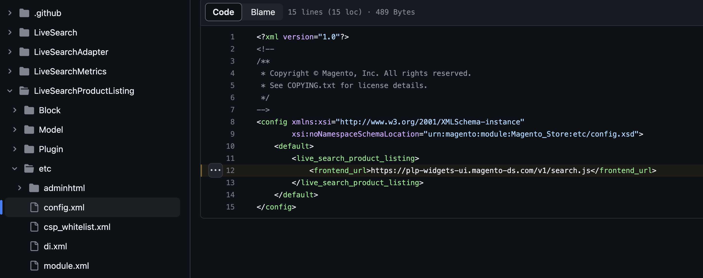
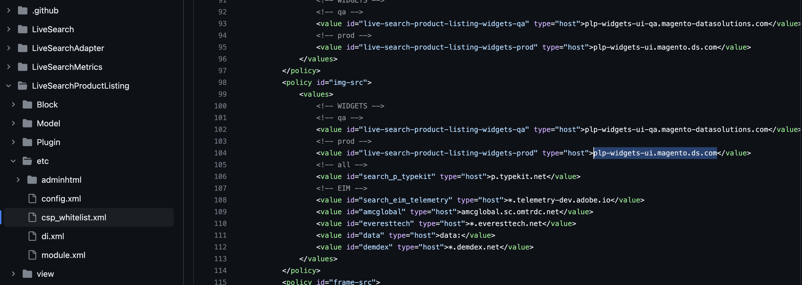

# storefront-product-listing-page

## Product Listing Page for Adobe Commerce Storefronts using Live Search

The product listing page provides coverage for both search and browse (PLP) results and includes the faceting, sorting, and product card areas on the page. This is the recommended default storefront PLP provided by Live Search. It provides a search experience that is client side rendered and hosted with a decoupled architecture.

The PLP calls the catalog service which extends the Live Search productSearch query to return product view data. This allows the PLP to render additional product attributes like swatches with a single call.

Learn more:

- Live Search https://experienceleague.adobe.com/docs/commerce-merchant-services/live-search/guide-overview.html?lang=en
- PLP https://experienceleague.adobe.com/docs/commerce-merchant-services/live-search/live-search-storefront/plp-styling.html?lang=en
- Catalog Service https://developer.adobe.com/commerce/webapi/graphql/schema/catalog-service/

## Repo containing the Live Search PLP

This repo is provided as a reference implementation only. While you’re expected to create your own customizations based on these assets, those customizations can’t be supported by Adobe.

Best practices include:

- forking this repo
- periodically rebasing with develop

## Setup

#### Requirements

Node and NPM setup: https://docs.npmjs.com/downloading-and-installing-node-js-and-npm

- Node version: **v16 or greater**
- NPM version: **v8 or greater**

[NVM](https://nodejs.org/en/download/package-manager#nvm) is a nifty tool to help toggle between enironment versions

#### Install dependencies

Within the root of the project (~/storefront-product-listing-page):

```
npm install
```

#### Storybook (mdx files)

Install storybook: https://storybook.js.org/docs/react/get-started/install

```
npm run storybook
```

#### Local Development

build tailwind styles and run locally

```
npm run tailwind:build
npm run dev
```

note: for styles to update you must run `npm run tailwind:build`

And open `localhost:8080/v1/index.html` in your favorite browser.

### Unit Testing

```
npm run test
```

### Build

```
npm run tailwind:build //builds tailwind styles
npm run build
```

search.js will be built to ./dist/

## Example setup:

import the script:

```
<script type="text/javascript" src="search.js"></script>
```

### Setup the Store Details:

Most of these will be passed with the extension if you have your storefront setup. The SANDBOX_KEY (api key for the sandbox env) is the only key that will need to be set within webpack.

#### Store Variables needed:

```
      ENVIRONMENT_ID
      WEBSITE_CODE
      STORE_CODE
      STORE_VIEW_CODE
      CUSTOMER_GROUP_CODE
      API_KEY
      SANDBOX_KEY // input this key into webpack.dev.js & webpack.prod.js
```

- To set up sandbox keys please see here: https://experienceleague.adobe.com/docs/commerce-merchant-services/catalog-service/installation.html?lang=en

#### insert into store details config

```
const storeDetails = {
      environmentId: 'ENVIRONMENT_ID',
      websiteCode: 'WEBSITE_CODE',
      storeCode: 'STORE_CODE',
      storeViewCode: 'STORE_VIEW_CODE',
      config: {
        minQueryLength: '2',
        pageSize: 8,
        perPageConfig: {
          pageSizeOptions: '12,24,36',
          defaultPageSizeOption: '24',
        },
        currencySymbol: '$',
        currencyRate: '1',
        displaySearchBox: true,
        displayOutOfStock: true,
        allowAllProducts: false,
        currentCategoryUrlPath?: string;
        currentCategoryId?: string;
        categoryName: '', // name of category to display
        displaySearchBox: false, // display search box
        displayOutOfStock: '', // "1" will return from php escapeJs and boolean is returned if called from data-service-graphql
        displayMode: '', // "" for search || "PAGE" for category search
        locale: '', //add locale for translations
        priceSlider: false, //enable slider for price - EXPERIMENTAL, default is false
        imageCarousel: false, //enable multiple image carousel - EXPERIMENTAL, default is false
        listview: false; //add listview as an option - EXPERIMENTAL, default is false
        optimizeImages: true, // optimize images with Fastly
        imageBaseWidth: 200,
        resolveCartId?: resolveCartId // Luma specific addToCart method. Enabled with the extension
        refreshCart?: refreshCart // Luma specific addToCart method. Enabled with the extension
        addToCart?: (sku, options, quantity)=>{} // custom add to cart callback function. Called on addToCart action
      },
      context: {
        customerGroup: 'CUSTOMER_GROUP_CODE',
      },
      apiKey: 'API_KEY',
    };
```

Append LiveSearchPLP to the storefront window:

```
const root = document.querySelector('div.search-plp-root');

setTimeout(async () => {
      while (typeof window.LiveSearchPLP !== 'function') {
        console.log('waiting for window.LiveSearchPLP to be available');
        await new Promise((resolve) => setTimeout(resolve, 500));
      }
      window.LiveSearchPLP({ storeDetails, root });
}, 1000);
```

You can see the example in [dev-template.html](./dev-template.html)

### Theming and Styling

We use Tailwind to style/theme our components. Here's a good read up if you are keen: [Tailwind Docs](https://tailwindcss.com/docs/utility-first)

In addition to this themeing, we have CSS classes where storefronts can target and customize specific components of the widget. CSS classes will be used to target specific components or elements of components for a more granular approach. In short, CSS variables can create a general theme and CSS classes can target specific elements in our widget.

With Tailwind we do not write custom CSS. Instead, we use its utility classes that are generated at buildtime using a config we provide and scanning our markup (this way we don't have extra CSS we don't need). This is our [config file](./tailwind.config.js).

So how do we use CSS variables to style our components? Great question 😄

Let's say as if I want to style an element with the theme's primary color. Normally, in CSS we would have done the following:

```
<style>
 .primaryColor {
    color: var(--primary-color)
 }
</style>

<div class="primaryColor">
  Yippee I am a primary color!
</div>
```

Using Tailwind the following produces the exact same result:

```
<div class="text-brand-700">
  Yippee I am a brand color!
</div>

```

Looking at the config file you will notice that the CSS variable is `--color-primary` is mapped to the Tailwind CSS theme color key `primary`. this means anywhere in Tailwind you would use a Color key in a class you can now use the word `primary`.

You can add your own variables to [tokens.css](./src/styles/tokens.css). Furthermore, you can define your own tailwind classes using these variables in the [config file](./tailwind.config.js).

### Have tailwind only apply to the nested widget

Now default behavior:

Follow the [tailwind nesting documentation](https://tailwindcss.com/docs/using-with-preprocessors#nesting). Your [postcss.config](./postcss.config.js) will look like this:

```
module.exports = {
  plugins: [
    require('postcss-import'),
    require('tailwindcss/nesting'),
    require('autoprefixer'),
    require('tailwindcss'),
    require('cssnano'),
  ],
};
```

From there you should be able to nest the tailwind classes:

```
@import 'tailwindcss/base';
@import 'tailwindcss/components';
@import 'tailwindcss/utilities';
```

within `.ds-widgets` in [token.css](./src/styles/tokens.css)

```
.ds-widgets {
  @import 'tailwindcss/base';
  @import 'tailwindcss/components';
  @import 'tailwindcss/utilities';

  ...
}
```

Some helpful tools when developing with tailwind:

- [Tailwind CSS Intellisense](https://marketplace.visualstudio.com/items?itemName=bradlc.vscode-tailwindcss)

### Developing with React

To extend and customize this repo, you must first be familiar with react:

- https://react.dev/learn
- https://preactjs.com/guide/v10/components // we use Preact, which is just a smaller bundle version of React

Example Implemention - adding a button to [ProductItem](./src/components/ProductItem/ProductItem.tsx):

```
export const ProductItem: FunctionComponent<ProductProps> = ({
  item,
  currencySymbol,
  currencyRate,
  setRoute,
  refineProduct,
}: ProductProps) => {
  ...

  const handleClickButton = () => {
    console.log('clicked the button!');
  }

  return (
    <div className="ds-sdk-product-item group relative flex flex-col max-w-sm justify-between h-full">
        ...
          <div className="flex flex-col">
            <div className="ds-sdk-product-item__product-name mt-md text-sm text-brand-700">
              {htmlStringDecode(productView.name)}
            </div>
            <ProductPrice
              item={refinedProduct ?? item}
              isBundle={isBundle}
              isGrouped={isGrouped}
              isGiftCard={isGiftCard}
              isConfigurable={isConfigurable}
              isComplexProductView={isComplexProductView}
              discount={discount}
              currencySymbol={currencySymbol}
              currencyRate={currencyRate}
            />
            <button onClick={handleClickButton}>I am a button!</button> // added a button
          </div>
        </div>
      </a>

    </div>
  );
};
```

For more robust examples, please see our [Examples folder](https://github.com/adobe/storefront-product-listing-page/tree/main/src/examples)

## Hosting with CDN

Follow the below instructions on how to host with CDN and update your Commerce store to include your new product listing page.

1. In the root of this repository, install dependencies: `npm install`
1. Create a production build of the application: `npm run build`
1. After the previous step succeeds, it will output a `search.js` file in the `dist/` directory. This is the production-ready product listing page.
1. Follow the instructions from your favorite frontend hosting with CDN (we use AWS S3 + Cloudfront, but there are many options to choose from) to upload the `search.js` file.
1. The hosting platform with CDN will provide you a url where the `search.js` file will be publicly hosted for your consumption.
1. Take the url where the `search.js` file is hosted and validate in your browser that it is working correctly by loading the url in your browser and seeing the `search.js` file returned to you.
1. Now the Live Search extension needs to be updated to include your new url. Find the `magento-live-search` extension code in your adobe commerce code base. Locate the directory `LiveSearchProductListing`.
1. We will be updating two files under `magento-live-search > LiveSearchProductListing`: `etc/config.xml` & `etc/csp_whitelist.xml`
1. Changes for `etc/config.xml`: change the live search url in `<frontend_url>`to match the one you created with your hosting/CDN solution url above. See below.
1. 
1. Changes for `etc/csp_whitelist.xml`: find all references to the live search SaaS product list page (`plp-widgets-ui.magento.ds.com`) and replace with your hosting/CDN solution url. See below.
1. 
1. Those are all the required changes. Now redeploy your adobe commerce store code and see your new custom product listing page in your storefront.

_The purpose of this project is to provide a dev-ready starting point for developers to implement the product listing page. The project, repo, and any accompanying assets included herein (“Assets”) are provided “as-is” for your use solely at your sole discretion, risk, and responsibility. By using these Assets, you agree Adobe will in no event be responsible for any use of the Assets, including but not limited to any customizations made thereto, by you or any third party. Adobe will not provide any support of any kind for any customizations made to the Assets by anyone._
